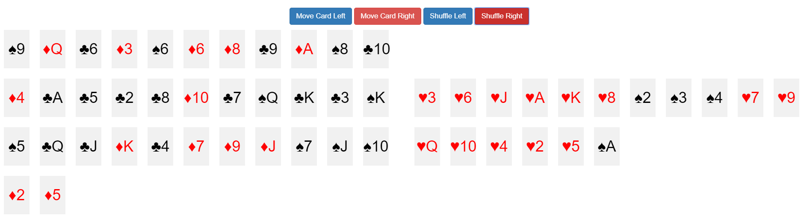

# Deck of Cards

Implement a deck of playing cards!

## Rules

* Playing cards have 4 suits: clubs ♣️, diamonds ♦️, hearts ♥️, and spades ♠️. 
* Each suit has 13 ranks. 
    * Face cards include: Ace, Jack, Queen, and King.
    * Non-face cards include 2 through 10.
* The card deck contains 52 cards.

## Sample Ideas

* As a user, I can see all 52 cards of the deck.
* As a user, I can toggle a card's visibility to make its value known or hidden.
* As a user, I can shuffle the deck of cards. Consider looking at the [Fisher-Yates shuffling algorithm](https://en.wikipedia.org/wiki/Fisher%E2%80%93Yates_shuffle).
* As a user, I can cut the deck into two halves, and have the ability to shuffle each half.

Here is a screenshot that might give you an idea

## Anything Else

There is a [Deck of Cards API](https://deckofcardsapi.com/). Consider looking to see if it offers any functionality you might want to leverage while practicing working with APIs.

The Deck of Cards API offers REST methods for:
* generating a full or partial deck of cards
* shuffling cards in a deck
* drawing a card from the deck
* creating piles
